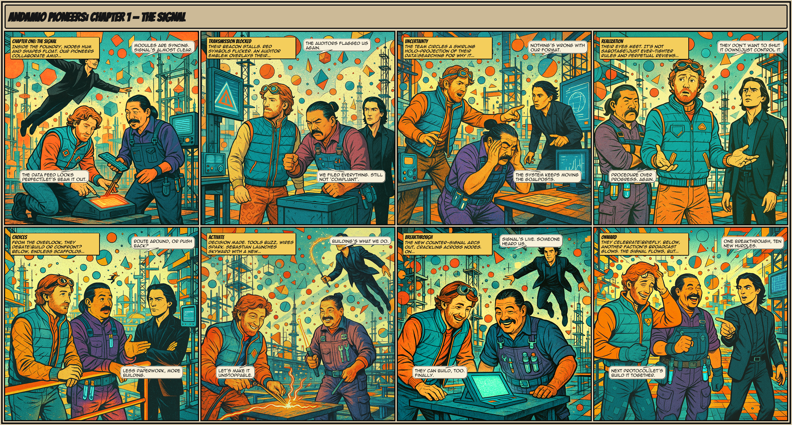

## Andamio Pioneer Program Meeting Agenda

> Cohort #001, Meeting #03 (2026-03-10)

## 1. Opening Question + Check in Round

What is a thought you've had about AI in the last 7 days?

## 2. Feedback Review

Here is a [recording of Session 2](https://youtu.be/dE1n0kaKIWI?si=1Qm102oEOQxqI7yN)

### 2a. Latest Issues

> Hover colors are not readable when hovering over the "8 verified" text. — @xeeban ([#4](https://github.com/Andamio-Platform/andamio-pioneers-cohort-001/issues/4))

This is targeted UX feedback - thank you!

> When minting an access token, I encountered an error because my wallet has no funds. Also, since the auth provider changed from MeshJS to UTXOs, the site has no profile page or a way to copy my new address. — @IanoNjuguna ([#5](https://github.com/Andamio-Platform/andamio-pioneers-cohort-001/issues/5))

This is about error handling - thank you! We'll improve on this.

### 2b. Roberto: Live Bug Fixing

## 3. Live Share: SLTs 102.4 and 102.5

- 102.4: I can launch a Project on Andamio.
- 102.5: I can create an Andamio API Key.

Today's goal: does this lesson serve as the "hello world" that Newman described last week?

## 4. Next Meeting: 2026-03-17, 1700 UTC

## Action Items

1. Use the built-in `/getting-started` skill in [andamio-app-template](https://github.com/Andamio-Platform/andamio-app-template) to create a new theme for the Andamio App Template. (Or build a new theme by hand - agent skills are optional!)

## Links

- Program Course: [https://mainnet.app.andamio.io/studio/course/bafebb4ccc3158e97764e02e0cf639f208d47264fed15211f745796e](https://mainnet.app.andamio.io/studio/course/bafebb4ccc3158e97764e02e0cf639f208d47264fed15211f745796e)
- Preprod Environment: [https://preprod.app.andamio.io/](https://preprod.app.andamio.io/)
- Andamio App Template: [https://github.com/Andamio-Platform/andamio-app-template](https://github.com/Andamio-Platform/andamio-app-template)
